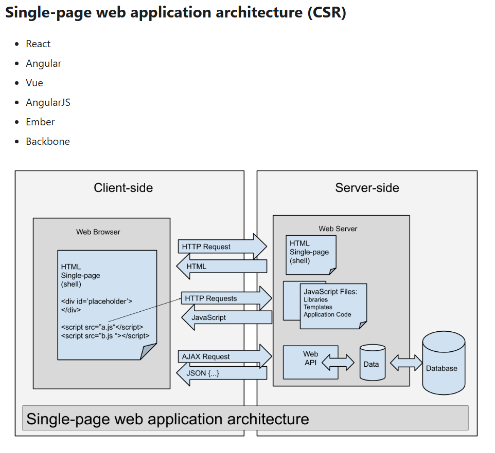
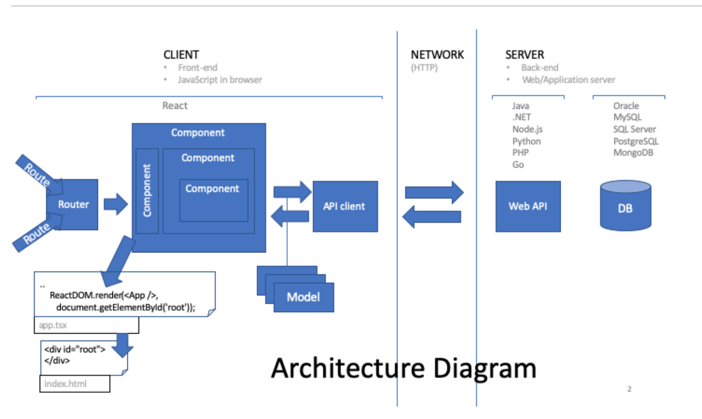
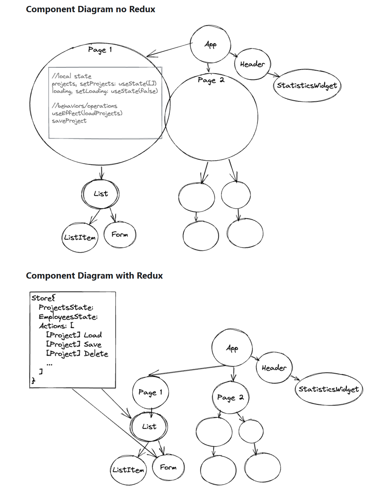
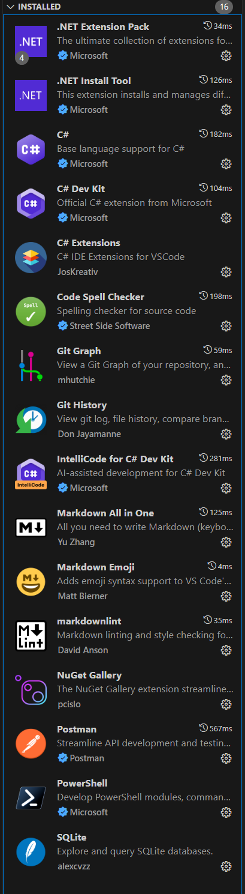
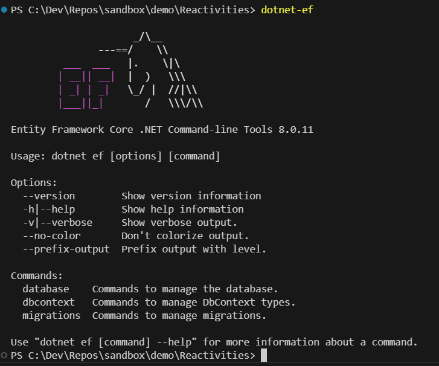
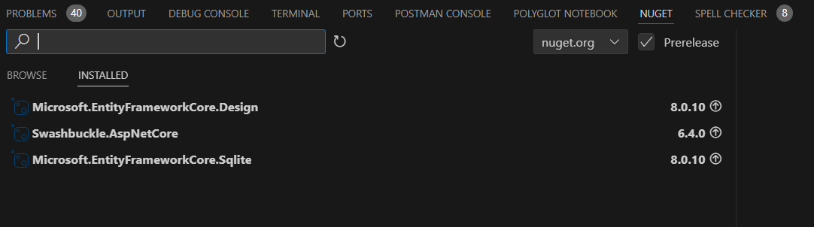
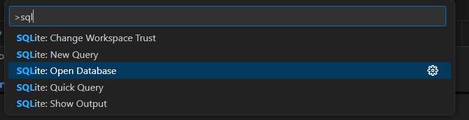
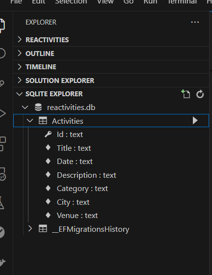

# .NET 8 REST API With React

## Definitions

### Architecture - <https://handsonreact.com/docs/architecture>

- It's valuable to understand how JavaScript applications are architected. In particular, it's valuable to understand how JavaScript application architecture is different from other web frameworks.

#### Where to Render

- It's useful to think about where the HTML and data come together or where the contents of a web page are rendered. There are three places to render:
  - **Server-side Rendering (SSR)**
    - on the web server in the chosen server-side programming language the most common servers-side programming languages are Java, C#, Python, Ruby, and PHP but it could be JavaScript running on a JavaScript runtime environment (for example: Node.js)
  - **Client-side Rendering (CSR)**
    - in the end user's web browser using a client-side programming language the most common client-side programming language is JavaScript Web Assembly has made it possible to use other languages in the browser
  - **Static Site Generation (SSG)**
    - on the developer machine or continuous build server at build time the most common languages are JavaScript (Next.js, Gatsby, Docusaurus, Nuxt, Astro), Go (Hugo), and Ruby (Jekyll) this is sometimes referred to as a Jamstack architecture here is a list of common SSGs

#### Where to render ERAS

- ERAS is going to be a Single-page web application architecture (CSR)
- 

### React Architecture - <https://handsonreact.com/docs/architecture>



### State Management in React

- What is State Management in React?
  - State management refers to the methods and techniques used to handle, organize, and share data within a React application. It involves the systematic management and manipulation of data, ensuring seamless integration and synchronization across various components.

- Benefits of React State Management
  - State management plays a pivotal role in developing dynamic and interactive applications that need to handle evolving data. This data can come from user interactions or other triggering events.

By implementing robust state management techniques, React applications can maintain data integrity, enhance performance, and provide a smooth user experience.

#### Props vs the Context API

- <https://www.freecodecamp.org/news/state-management-in-react-props-vs-context-api/>

### Redux Architecture

- <https://handsonreact.com/docs/redux>
- 
  
#### React Virtual DOM

- <https://github.com/eggheadio/illustrated-dev/blob/master/content/explainers/react-vdom/index.mdx>

## Computer Setup

- <https://handsonreact.com/docs/computer-setup>

## Visual Studio Code Setup

- <https://handsonreact.com/docs/visual-studio-code-setup>
- Recommended Extensions
  - 

## dotnet command line


```
dotnet info
```

- global json for multiple profile .NET SDKs installed:

```
dotnet new list
```

copy and paste in terminal content of

Explain 
- launchSettings.json change port
- program.cs
  -  services/configuration
  -  build
  -  middleware
  - run

## roots and endpoint

- run app
  - Listening
  - swagger
- Postman endpoint

## Create Domain Entity (Using Code First)

- Add class for Entity (Model) 
  - Id
  - properties public with setters and getters
  - class relates to a table
- ORM Sqlite to prototype or use SQL server sam
  - Add package Persistence layer
    - Microsoft.EntityFrameworkCore.Sqlite
  - Add class DataContext inherit from DbContext 
    - ?hove over to show patterns
    - ?Quick Fix for constructor
      - 
    - Specify DBSet to match your table
  
### Adding an Entity Framework DbContext to API 

- Run from root folder restore packages

```
dotnet restore
```

- Add DbContext to program.cs
- Add connection string to appsettings

## Creating Migration

- need tool `dotnet-ef`
- check which tools are already installed

```
dotnet tool list -g
```

- go to <https://www.nuget.org/packages/dotnet-ef/> to get the command to install the tool
- install dotnet-ef
- validate installation

```
dotnet-ef
```

- 
- Initialize migration 
- (note will error out because we did not installed Microsoft.EntityFrameworkCore.Design yet)
- Install package Microsoft.EntityFrameworkCore.Design in api and re-run migration
- 

```bash
dotnet ef migrations add InitialCreate -s API -p Persistence 
```

```console
PS C:\Dev\Repos\sandbox\demo\Reactivities> dotnet ef migrations add InitialCreate -s API -p Persistence 
Build started...
Build succeeded.
Done. To undo this action, use 'ef migrations remove'
```


- check migration folder which files have been created
  - Convention on Id otherwise you need to specify with [key]
  - note all nullable (Validation will be created later)
- run

```bash
cd API 
```

- create scope and call migration on start of the API
  - Show program.cs section
- start application

```bash
dotnet watch 
```


- examine console
- open sqlite with vs extension 
  - 
  - 

### Seeding

- Create Seed.cs from snip
- explain seeding
- add to program.cs
- restart app to seed the db

```bash
dotnet watch 
```

### Adding API controller and Base controller

- Show 